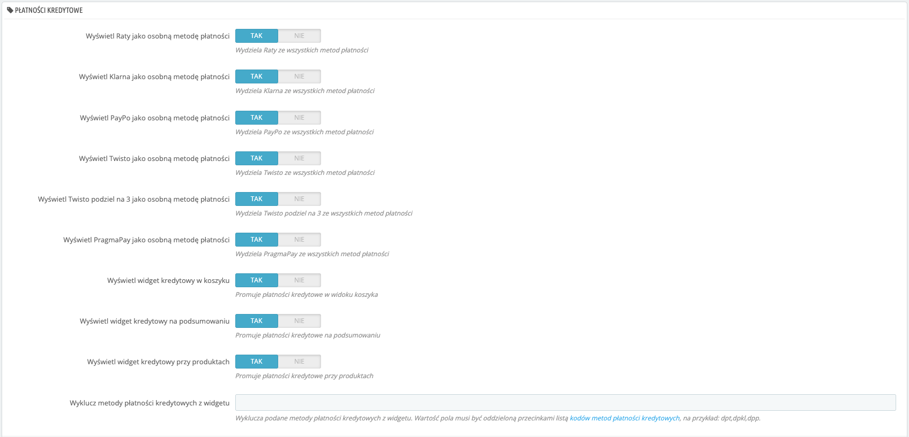
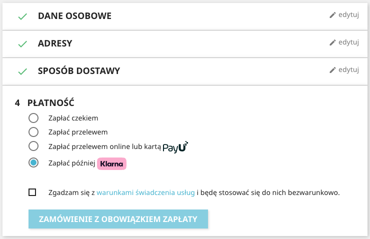

[**Wersja polska**][ext0]

# PayU plugin for Prestashop 1.6, 1.7, 8 and 9

**If you have any questions or issues, feel free to contact our [technical support][ext13].**

Note: Plugin [version 2.x](https://github.com/PayU/plugin_prestashop/tree/2.x) supports PrestaShop versions 1.4 and 1.5, but is not developed any more.

## Table of Contents

* [Features](#features)
* [Prerequisites](#prerequisites)
* [Installing](#installation)
* [Upgrading](#upgrade)
* [Configuration](#configuration)
* [More on features](#more-on-features)
    * [Multi-currency](#multi-currency)
    * [Payment method display](#payment-method-display)
    * [Card payment](#card-payment)
    * [Card payment - widget](#card-payment-widget)
    * [Payment retry](#payment-retry)
    * [Promote credit payment methods](#promote-credit-payment-methods)
* [Known issues](#known-issues)

## Features
The PayU payments Prestashop plugin adds the PayU payment option and enables you to process the following operations in your e-shop:

Plugin version 3.x supports PrestaShop versions 1.6 and 1.7

| Feature                                                    |   PrestaShop 1.6   | PrestaShop 1.7 / 8 / 9 |
|------------------------------------------------------------|:------------------:|:----------------------:|
| Creating a payment order (with discounts included)         | :white_check_mark: |   :white_check_mark:   |
| Capturing a payment order (when auto-capture is disabled)  | :white_check_mark: |   :white_check_mark:   |
| Conducting a refund operation (whole or partial)           | :white_check_mark: |   :white_check_mark:   |
| Displaying payment methods on Presta checkout summary page | :white_check_mark: |   :white_check_mark:   |
| Card payment as separate method                            | :white_check_mark: |   :white_check_mark:   |
| Card payment via widget on summary page                    | :white_check_mark: |   :white_check_mark:   |
| Payment retry for cancelled payments                       | :white_check_mark: |   :white_check_mark:   |
| Repayment                                                  | :white_check_mark: |   :white_check_mark:   |
| Multi-currency support                                     | :white_check_mark: |   :white_check_mark:   |
| Payment method order                                       | :white_check_mark: |   :white_check_mark:   |
| [PayU Installments][ext10] payment as separate method      | :white_check_mark: |   :white_check_mark:   |
| Klarna payment as separate method                          | :white_check_mark: |   :white_check_mark:   |
| PayPo payment as separate method                           | :white_check_mark: |   :white_check_mark:   |
| Twisto payment as separate method                          | :white_check_mark: |   :white_check_mark:   |
| Twisto Pay in 3 payment as separate method                 | :white_check_mark: |   :white_check_mark:   |
| PragmaPay as separate method                               | :white_check_mark: |   :white_check_mark:   |
| Present credit widget on product and listing page          | :white_check_mark: |   :white_check_mark:   |
| Present credit widget in checkout view                     | :white_check_mark: |   :white_check_mark:   |
| Present credit widget in cart view                         |        :x:         |   :white_check_mark:   |
| Excluding credit payment methods from credit widget        |        :white_check_mark:         |   :white_check_mark:   |

More information on the features can be found in the [More on features](#more-on-features) section

**All instructions regard PrestaShop 1.7, for other versions corresponding options should be used**.

## Prerequisites

**Important:** This plugin works only with 'REST API' (Checkout) points of sales (POS).
If you do not already have PayU merchant account, [**please register in Production**][ext4] or [**please register in Sandbox**][ext5]

The following PHP extensions are required: [cURL][ext1] and [hash][ext2].

## Installation

### Option 1
**recommended for users without FTP access to their PrestShop installation**

1. Download file `payu_prestashop_plugin_X.Y.Z.zip` from [releases][ext3]
2. Go to the PrestaShop administration page [http://adres-sklepu/adminxxx].
3. Go to 'Modules and Services' > 'Modules and Services'.
4. Use 'Add a new module' option and point the archive containing the plugin (downloaded in step 1)
5. Load the plugin

### Option 2
**recommended for users with FTP access to their PrestaShop installation**

1. Download file `payu_prestashop_plugin_X.Y.Z.zip` from [releases][ext3]
2. Unzip locally downloaded file
3. Upload all unzipped files from your computer to `modules/payu` catalog of your PrestaShop installation.

## Upgrade

1. Update plugin files according to [Installing](#installation)
2. Go to do 'Modules and Services' > 'Modules and Services' - automated upgrade will be performed if required
3. Go to **Advanced Parameters** > 'Performance' and click 'Clear cache'

## Configuration

1. Go to the PrestaShop administration page [http://adres-sklepu/adminxxx].
2. Go to 'Modules and Services' > 'Modules and Services'.
3. Search and select 'PayU' and click 'Configure'.

### Integration method

| Parameter                       | Description                                                                                                                                                                                                                                                                                                                        |
|---------------------------------|------------------------------------------------------------------------------------------------------------------------------------------------------------------------------------------------------------------------------------------------------------------------------------------------------------------------------------|
| Bank List                       | `Yes` choosing the PayU payment method will be possible on checkout page when selected *Pay by online transfer* `No` after placing an order on PrestaShop, you will be automatically redirected to PayU. Do not enable these options if you are using PrestaShop and OPC module [more info](#prestashop-16-and-opc-module).  |
| Payment method order            | enables custom payment method ordering [more info](#payment-method-order)                                                                                                                                                                                                                                                          |
| Card payment as separate method | sets card payment as separate method [more info](#card-payment)                                                                                                                                                                                                                                                                    |
| Card payment widget             | renders a widget on Presta summary instead of redirecting to PayU [more info](#card-payment-widget)                                                                                                                                                                                                                                |
| BLIK payment as separate method | sets BLIK payment as separate method                                                                                                                                                                                                                                                                                               |
| Sandbox mode                    | `Yes` - transactions will be processed on PayU Sandbox environment `No` - transactions will be processed on PayU production environment                                                                                                                                                                                         |
| Save logs                       | Specifies whether the plugin will save information to logs.                                                                                                                                                                                                                                                                        |

#### POS Parameters

For each currency defined in Presta please configure the below parameters (separately for sandbox and production environment).

|       Parameter       |            Description             |
|:---------------------:|:----------------------------------:|
|        POS ID         |       Unique ID of the POS         |
|      Second Key       | MD5 key for securing communication |
|   OAuth - client_id   |        client_id for OAuth         |
| OAuth - client_secret |      client_secret for OAuth       |

### Payment status mapping
Mapowanie statusów płatności w PayU na statusy w skepie PrestaShop

| Name                                  | PayU payment status | Default value in Presta |
|---------------------------------------|---------------------|-------------------------|
| Started - status after placing order  |                     | PayU payment started    |
| Complete status                       | `COMPLETED`         | Payment accepted        |
| Canceled status                       | `CANCELED`          | PayU payment canceled   |

If the option `Control of status changes` is enabled for status "Complete" and "Canceled" it is possible to switch only from the status "Pending" and "Waiting For Confirmation"

## More on features

### Payment method order
 Applies only to  **Payment methods displayed on Presta checkout summary page** switched to `Yes`
 To set the order of the payment method icons enter payment method values separated by comma.
 [Payment method values][ext6].

### Multi-currency
POS in PayU system has only one currency defined. Therefore to accept payments in more currencies, POS for each currency has to be separately configured.
Error ERROR_INCONSISTENT_CURRENCIES means an unsupported currency by POS. Contact with PayU service is required when approving the payment option in a different currency for the sandbox mode and a separate agreement for the production mode.

### Payment method display
When **Payment methods displayed on Presta checkout summary page** parameter is set to `Yes` payment method icons will be displayed directly within PrestaShop page when 'PayU with PayU' button is clicked.
The icons are displayed basing on POS configuration.  

![payment_methods][img3]

After payment method icon is selected and 'I confirm my order' button clicked, the buyer is redirected to bank or PayU card form.  

### Card payment
If **Card payment as separate method** option is enabled, a method named `Pay by card` will be displayed in PrestaShop checkout process.

If **Payment methods displayed on PrestaShop checkout summary page** option is set to `Yes` then `Pay by card` will be displayed only if card payments are configured on your POS ID. If this option is set to `No` then `Pay by card` will be always visible but may fail if card payments are not configured. 

![payment_methods][img6]

### Card payment widget
**IMPORTANT** - this feature will work only if "tokenization" is enabled on your POS ID in PayU. To enable it, please contact our [technical support][ext13].

If **Card payment as separate method** and **Payment methods displayed on Presta checkout summary page** are set to `Yes` then the `Pay by card` option will render a widget to collect card data instead of redirection to PayU card form page.

![widget][img5]

### Payment retry

This feature enables the payer to create a new payment for the same order if the previous payment was not successful.

To use the feature it is necessary to properly configure your POS in PayU, by disabling "Automatic collection" (it is enabled by default). This option is available in PayU panel. You need to go to Online payments then My shops and then POS. "Automatic collection is configured for every payment type, but to disable all at once you can use button at the very bottom, under the payment type list.

Repayment allows to create many payments in PayU for a single PestaShop order. The plugin will automatically collect the first successful payment, all other will be canceled. From user point of view, repayment is possible:
* by clicking a link in the order confirmation email
* in order details

![retry_payment][img4]

All PayU payments created for a PrestaShop order are displayed on Order screen in PrestaShop admin panel.

### Promote installments and Buy Now Pay Later payment methods
Plugin provides a functionality of promoting [installments and Buy Now Pay Later payment methods][ext7] (also called "credit payments") by separating individual payment methods in the checkout view and displaying a credit payments widget on product and listing pages, in the checkout, and cart views.
Promoting installment and Buy Now Pay Later payment methods is configured in the "Credit payments" section of the plugin's configuration page. Separating PayU Installments and credit payments widget are enabled by default. 
Support for given functionalities has been described in [Features](#features) section.
 > Presenting credit widgets is dependent on gateways availability for the given point of sale (POS).
 The plugin automatically checks whether "ai", "dpt", "dpcz", "dpts", "dpkl", "dpklczk", "dpkleur", "dpklhuf", "dpp", "dppron", "ppf" gateways are enabled.
 If a given credit payment method hasn't been enabled on the configured POS, it won't be presented in the checkout view or the credit payments widget even if it is enabled in the plugin's configuration.

#### Presentation of installments and Buy Now Pay Later payment methods depending on PrestaShop version
|PrestaShop Version| Category                                   |How it looks|
|---------|--------------------------------------------|-----------|
|1.7| Products listing                           |  |
|1.7| Product page                               ||
|1.7| Cart                                       | |
|1.7| Installments as separate method            ||
|1.7| PayPo payment as separate method           ||
|1.7| Klarna payment as separate method          ||
|1.7| Twisto payment as separate method          ||
|1.7| Twisto Pay in 3 payment as separate method ||
|1.7| PragmaPay payment as separate method       ||
|1.6| Products listing                           ||
|1.6| Product page                               ||

    
#### Presentation of the credit payments widget
Depending on the available credit payment methods, hyperlinks appear in the above-mentioned site sections in one of three variants: "Installment from", "0% installment from" or "Pay later". After clicking on such hyperlink, the newest version of "miniInstallment" component will appear on the screen, that comes with [PayU Installments - best practices][ext12] package, that can be found in [official documentation][ext8].

The credit payments widget ("miniInstallment" component) looks as below:

Since version 3.3.0 it's possible to exclude the specified credit payment methods from the widget using the "Exclude credit payment methods from widget" field in the plugin's configuration. For example, filling the field with these values: dpp,dpkl,dpt will result in PayPo, Klarna, and Twisto disappearing from the widget:

## Known issues
### PrestaShop and OPC modules
Due to fact that OPC modules builds its own checkout page, some options e.g. `Card payment as separate method`, `BLIK payment as separate method` and separation of installment methods may not work.
<!--LINKS-->

<!--external links:-->
[ext0]: README.md
[ext1]: http://php.net/manual/en/book.curl.php
[ext2]: http://php.net/manual/en/book.hash.php
[ext3]: https://github.com/PayU-EMEA/plugin_prestashop/releases
[ext4]: https://www.payu.pl/en/commercial-offer
[ext5]: https://secure.snd.payu.com/boarding/#/form&pk_campaign=Plugin-Github&pk_kwd=Prestashop
[ext6]: http://developers.payu.com/en/overview.html#paymethods
[ext7]: https://developers.payu.com/en/installments.html
[ext8]: https://developers.payu.com/en/installments.html#installments_best_practices_mini
[ext10]: https://www.payu.pl/en/payment-methods-business/payu-installments
[ext12]: https://developers.payu.com/en/installments.html#best_practices_title
[ext13]: https://www.payu.pl/en/help

<!--images:-->
[img3]: readme_images/bramki_platnosci.png
[img4]: readme_images/ponow_platnosc.png
