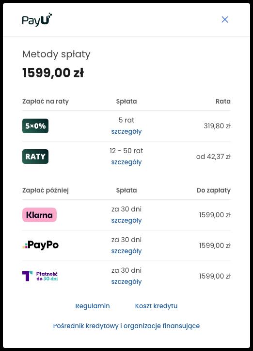

[**Wersja polska**][ext0]

# PayU plugin for Prestashop 1.6 and 1.7
``This plugin is released under the GPL license.``

**If you have any questions or issues, feel free to contact our [technical support][ext13].**

Note: Plugin [version 2.x](https://github.com/PayU/plugin_prestashop/tree/2.x) supports PrestaShop versions 1.4 and 1.5, but is not developed any more.

## Table of Contents

* [Features](#features)
* [Prerequisites](#prerequisites)
* [Installing](#installation)
* [Upgrading](#upgrade)
* [Configuration](#configuration)
* [More on features](#more-on-features)
    * [Multi-currency](#multi-currency)
    * [Payment method display](#payment-method-display)
    * [Card payment](#card-payment)
    * [Card payment - widget](#card-payment-widget)
    * [Payment retry](#payment-retry)
    * [Promote credit payment methods](#promote-credit-payment-methods)

## Features
The PayU payments Prestashop plugin adds the PayU payment option and enables you to process the following operations in your e-shop:

Plugin version 3.x supports PrestaShop versions 1.6 and 1.7

| Feature | PrestaShop 1.6 | PrestaShop 1.7 |
|---------|:-----------:|:-----------:|
| Creating a payment order (with discounts included) | :white_check_mark: | :white_check_mark: |
| Capturing a payment order (when auto-capture is disabled) | :white_check_mark: | :white_check_mark: |
| Conducting a refund operation (whole or partial) | :white_check_mark: | :white_check_mark: |
| Displaying payment methods on Presta checkout summary page | :white_check_mark: | :white_check_mark: |
| Card payment as separate method | :white_check_mark: | :white_check_mark: |
| Card payment via widget on summary page | :white_check_mark: | :white_check_mark: |
| Payment retry for cancelled payments | :white_check_mark: | :white_check_mark: |
| Multi-currency support | :white_check_mark: | :white_check_mark: |
| Payment method order | :white_check_mark: | :white_check_mark: |
| Promoting [PayU Installments][ext10] and [PayU Later][ext9] | :white_check_mark: | :white_check_mark: |
| Twisto payment as separate method | :white_check_mark: | :white_check_mark: |
| Present installment estimated value on product and listing page | :white_check_mark: |:white_check_mark: |
| Present installment estimated value in checkout view | :white_check_mark: | :white_check_mark: |
| Present installment estimated value in cart view| :x: | :white_check_mark: |

More information on the features can be found in the [More on features](#more-on-features) section

**All instructions regard PrestaShop 1.6, for versions 1.7 corresponding options should be used**.

## Prerequisites

**Important:** This plugin works only with 'REST API' (Checkout) points of sales (POS).
If you do not already have PayU merchant account, [**please register in Production**][ext4] or [**please register in Sandbox**][ext5]

The following PHP extensions are required: [cURL][ext1] and [hash][ext2].

## Installation

### Option 1
**recommended for users without FTP access to their PrestShop installation**

1. Download plugin from [the plugin repository](https://github.com/PayU/plugin_prestashop) to local directory as zip.
1. Unzip locally downloaded file
1. **Create zip archive of payu directory**
1. Go to the PrestaShop administration page [http://adres-sklepu/adminxxx].
1. Go to 'Modules and Services' > 'Modules and Services'.
1. Use 'Add a new module' option and point the archive containing the plugin (created in step 3)
1. Load the plugin

### Option 2
**recommended for users with FTP access to their PrestaShop installation**

1. Download plugin from [the plugin repository](https://github.com/PayU/plugin_prestashop) to local directory as zip.
1. Unzip locally downloaded file
1. Upload **'payu'** directory from your computer to **'modules'** catalog of your PrestaShop installation.

## Upgrade

1. Update plugin files according to [Installing](#installation)
1. Go to do 'Modules and Services' > 'Modules and Services' - automated upgrade will be performed if required  
1. Go to **Advanced Parameters** > 'Performance' and click 'Clear cache'

## Configuration

1. Go to the PrestaShop administration page [http://adres-sklepu/adminxxx].
1. Go to 'Modules and Services' > 'Modules and Services'.
1. Search and select 'PayU' and click 'Configure'.

### Integration method

| Parameter | Description |
|:---------:|:-----------:|
| Payment methods displayed on PrestaShop checkout summary page | **Yes** - payment methods displayed on PrestaShop checkout page  **No** - redirection to PayU after order is placed|
| Card payment as separate method | sets card payment as separate method [more info](#card-payment) |
| Card payment widget | renders a widget on Presta summary instead of redirecting to PayU [more info](#card-payment-widget) |
| Payment method order | enables custom payment method ordering [more info](#payment-method-order) |
| Sandbox mode | **Yes** - transactions will be processed on PayU Sandbox environment **No** - transactions will be processed on PayU production environment|

#### POS Parameters

For each currency defined in Presta please configure the below parameters (separately for sandbox and production environment).

| Parameter | Description |
|:---------:|:-----------:|
|POS ID|Unique ID of the POS|
|Second Key|MD5 key for securing communication|
|OAuth - client_id|client_id for OAuth|
|OAuth - client_secret|client_secret for OAuth|

### Payment status mapping
Mapowanie statusów płatności w PayU na statusy w skepie PrestaShop

| Name | PayU payment status | Default value in Presta |
|---------|-----------|-----------|
| Pending status | `NEW` and `PENDING` | PayU payment started |
| Waiting for confirmation | `WAITING_FOR_CONFIRMATION` and `REJECTED` | PayU payment awaits for reception |
| Complete status | `COMPLETED` | Payment accepted |
| Canceled status | `CANCELED` | Canceled |

If the option `Control of status changes` is enabled for status "Complete" and "Canceled" it is possible to switch only from the status "Pending" and "Waiting For Confirmation"

## More on features

### Payment method order
 Applies only to  **Payment methods displayed on Presta checkout summary page** switched to `Yes`
 To set the order of the payment method icons enter payment method values separated by comma.
 [Payment method values][ext6].

### Multi-currency
POS in PayU system has only one currency defined. Therefore to accept payments in more currencies, POS for each currency has to be separately configured.
Error ERROR_INCONSISTENT_CURRENCIES means an unsupported currency by POS. Contact with PayU service is required when approving the payment option in a different currency for the sandbox mode and a separate agreement for the production mode.

### Payment method display
When **Payment methods displayed on Presta checkout summary page** parameter is set to `Yes` payment method icons will be displayed directly within PrestaShop page when 'PayU with PayU' button is clicked.
The icons are displayed basing on POS configuration.  

![payment_methods][img3]

After payment method icon is selected and 'I confirm my order' button clicked, the buyer is redirected to bank or PayU card form.  

### Card payment
If **Card payment as separate method** option is enabled, a method named `Pay by card` will be displayed in PrestaShop checkout process.

If **Payment methods displayed on PrestaShop checkout summary page** option is set to `Yes` then `Pay by card` will be displayed only if card payments are configured on your POS ID. If this option is set to `No` then `Pay by card` will be always visible but may fail if card payments are not configured. 

![payment_methods][img6]

### Card payment widget
**IMPORTANT** - this feature will work only if "tokenization" is enabled on your POS ID in PayU. To enable it, please contact our [technical support][ext13].

If **Card payment as separate method** and **Payment methods displayed on Presta checkout summary page** are set to `Yes` then the `Pay by card` option will render a widget to collect card data instead of redirection to PayU card form page.

![widget][img5]

### Payment retry
When payment fails (i.e. is canceled), the buyer can pay again.
Following criteria should be met to enable payment retry:
* payment has to have CANCELED status in PayU
* order status in PrestaShop has to be in line with status configured for 'Canceled status'

If the criteria are met, the buyer will see a retry option on Order details screen.  

![retry_payment][img4]

All PayU payments created for a PrestaShop order are displayed on Order screen in PrestaShop admin panel.

### Promote credit payment methods
Plugin version 3.0.10 introduced functionality of promoting [credit payment methods][ext7].
Functionality is enabled by default. It can be deactivated using "Promote credit" switch in admin panel.
Support for given functionalities has been described in [Features](#features) section.
 > Presenting credit widgets is dependent on gateways availability for given point of sale (POS).
 Plugin automatically checks whether "ai" or "dpt" gateways are enabled.
 If used POS doesn't have credit agreement activated functionality will not work, and widget presentation will be
 supressed (even if flag in admin panel is enabled).

#### Presentation of estimated installment amount depending on PrestaShop version
|PrestaShop Version|Category|How it looks|
|---------|-----------|-----------|
|1.7|Products listing|  |
|1.7|Product page||
|1.7|Cart| |
|1.7|Promote credit payment methods||
|1.7|Twisto payment as separate method||
|1.6|Products listing||
|1.6|Product page||

#### Presentation of estimated installment amount after clicking "Installment from:"
Plugin uses newest version of "miniInstallment" component that comes with [PayU Installments - best practices][ext12] package, that can be found in [official documentation][ext8].

Popup with estimated installment plan looks as below:

<!--LINKS-->

<!--external links:-->
[ext0]: README.md
[ext1]: http://php.net/manual/en/book.curl.php
[ext2]: http://php.net/manual/en/book.hash.php
[ext3]: https://github.com/PayU/plugin_prestashop
[ext4]: https://www.payu.pl/en/commercial-offer
[ext5]: https://secure.snd.payu.com/boarding/#/form&pk_campaign=Plugin-Github&pk_kwd=Prestashop
[ext6]: http://developers.payu.com/en/overview.html#paymethods
[ext7]: https://developers.payu.com/en/installments.html
[ext8]: https://developers.payu.com/en/installments.html#installments_best_practices_mini
[ext9]: https://www.payu.pl/en/payment-methods/pay-later
[ext10]: https://www.payu.pl/en/payment-methods-business/payu-installments
[ext11]: https://developers.payu.com/en/installments.html#dp_best_practices_mini
[ext12]: https://developers.payu.com/en/installments.html#best_practices_title
[ext13]: https://www.payu.pl/en/help

<!--images:-->
[img3]: readme_images/bramki_platnosci.png
[img4]: readme_images/ponow_platnosc.png
