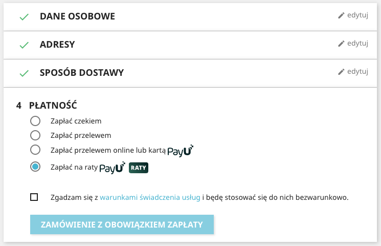
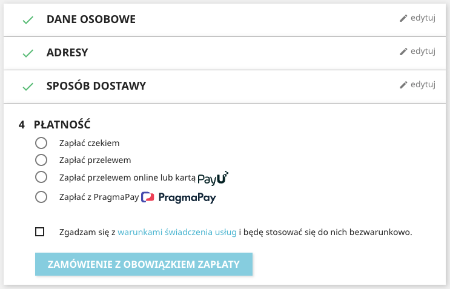
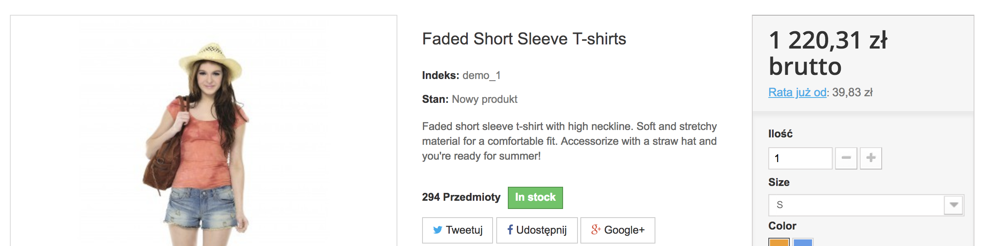

[**English version**][ext0]

# Moduł PayU dla PrestaShop 1.6, 1.7, 8 i 9

**Jeżeli masz jakiekolwiek pytania lub chcesz zgłosić błąd zapraszamy do kontaktu z naszym [wsparciem technicznym][ext13].**

Uwaga: plugin w [wersji 2.x](https://github.com/PayU/plugin_prestashop/tree/2.x) wspiera PrestaShop w wersji 1.4 i 1.5, ale nie jest dalej rozwijany.

## Spis treści

* [Cechy i kompatybilność](#cechy-i-kompatybilność)
* [Wymagania](#wymagania)
* [Instalacja](#instalacja)
* [Aktualizacja](#aktualizacja)
* [Konfiguracja](#konfiguracja)
* [Logowanie](#logowanie)
* [Więcej o cechach](#więcej-o-cechach)
    * [Wielowalutowość](#wielowalutowość)
    * [Wyświetlenie metod płatności](#wyświetlenie-metod-płatności)
    * [Płatność kartą](#płatność-kartą)
    * [Płatność kartą - widżet](#widżet-do-płatności-kartą)
    * [Ponawianie płatności](#ponawianie-płatności)
    * [Promowanie płatności ratalnych i odroczonych](#promowanie-płatności-ratalnych-i-odroczonych)
* [Znane problemy](#znane-problemy)

## Cechy i kompatybilność
Moduł płatności PayU dodaje do PrestaShop opcję płatności PayU i pozwala na następujące operacje:

Plugin w wersji 3.x wspiera PrestaShop w wersji 1.6 i 1.7

| Cecha                                                                          |   PrestaShop 1.6   | PrestaShop 1.7 / 8 / 9 |
|--------------------------------------------------------------------------------|:------------------:|:----------------------:|
| Utworzenie płatności (wraz z rabatami)                                         | :white_check_mark: |   :white_check_mark:   |
| Odebranie lub odrzucenie płatności (w przypadku wyłączonego autoodbioru)       | :white_check_mark: |   :white_check_mark:   |
| Utworzenie zwrotu (pełnego lub częściowego)                                    | :white_check_mark: |   :white_check_mark:   |
| Wyświetlenie metod płatności i wybranie metody na stronie składania zamówienia | :white_check_mark: |   :white_check_mark:   |
| Płatność kartą jako osobna metoda płatności                                    | :white_check_mark: |   :white_check_mark:   |
| Płatność kartą jako widżet                                                     | :white_check_mark: |   :white_check_mark:   |
| Płatność Blik jako osobna metoda płatności                                     | :white_check_mark: |   :white_check_mark:   |
| Ponowienie płatności                                                           | :white_check_mark: |   :white_check_mark:   |
| Wielowalutowość                                                                | :white_check_mark: |   :white_check_mark:   |
| Kolejność metod płatności                                                      | :white_check_mark: |   :white_check_mark:   |
| Płatność [PayU Raty][ext10] jako osobna metoda płatności                       | :white_check_mark: |   :white_check_mark:   |
| Płatność Klarna jako osobna metoda płatności                                   | :white_check_mark: |   :white_check_mark:   |
| Płatność PayPo jako osobna metoda płatności                                    | :white_check_mark: |   :white_check_mark:   |
| Płatność Twisto jako osobna metoda płatności                                   | :white_check_mark: |   :white_check_mark:   |
| Płatność Twisto podziel na 3 jako osobna metoda płatności                      | :white_check_mark: |   :white_check_mark:   |
| Płatność PragmaPay jako osobna metoda płatności                                | :white_check_mark: |   :white_check_mark:   |
| Prezentacja widgetu kredytowego przy produkcie i listingu                      | :white_check_mark: |   :white_check_mark:   |
| Prezentacja widgetu kredytowego na podsumowaniu                                | :white_check_mark: |   :white_check_mark:   |
| Prezentacja widgetu kredytowego w koszyku                                      |        :x:         |   :white_check_mark:   |
| Wykluczenie metod płatności kredytowych z widgetu                              | :white_check_mark: |   :white_check_mark:   |

Więcej informacji o cechach można znaleźć w rozdziale [Więcej o cechach](#więcej-o-cechach)

**Wszyskie opisy w tej instrukcji odnoszą się do PrestaShop 1.7 w innych wersjach należy używać opcji analogicznych**.

## Wymagania

**Ważne:** Moduł działa tylko z punktem płatności typu `REST API` (Checkout).
Jeżeli nie posiadasz jeszcze konta w systemie PayU [**zarejestruj się w systemie produkcyjnym**][ext4] lub [**zarejestruj się w systemie sandbox**][ext5]

Do prawidłowego funkcjonowania modułu wymagane są następujące rozszerzenia PHP: [cURL][ext1] i [hash][ext2].

## Instalacja

### Opcja 1
**przeznaczona dla użytkowników bez dostępu poprzez FTP do instalacji PrestaShop**

1. Pobierz plik `payu_prestashop_plugin_X.Y.Z.zip` z najnowszej wersji modułu z [wydanych wersji][ext3]
2. Przejdź do strony administracyjnej swojego sklepu PrestaShop [http://adres-sklepu/adminxxx].
3. Przejdź do `Moduły` » `Moduły i usługi`
4. Naciśnij przycisk `Dodaj nowy moduł` i wybierz plik z archiwum modułu (pobrany w punkcie 3)
5. Naciśnij przycisk `Prześlij moduł`

### Opcja 2
**przeznaczona dla użytkowników z dostępem poprzez FTP do instalacji PrestaShop**

1. Pobierz plik `payu_prestashop_plugin_X.Y.Z.zip` z najnowszej wersję modułu z [wydanych GitHub][ext3]
2. Rozpakuj pobrany plik
3. Połącz się z serwerem ftp i skopiuj zawartość rozpakowanego pliku do katalogu `modules/payu` swojego sklepu PrestaShop

## Aktualizacja

1. Zaktualizuj plik modułu zgodnie z punktem [Instalacja](#instalacja)
2. Przejdź do `Moduły` » `Menedżer modułów `
3. W zakładce `Aktualizacje` wykonaj aktualizację modułu jeżeli będzie dostępna
4. Przejdź do `Parametry zaawansowane` » `Wydajność` i naciśnij przycisk `Wyczyść pamięć podręczną`

## Konfiguracja

1. Przejdź do strony administracyjnej swojego sklepu PrestaShop [http://adres-sklepu/adminxxx].
1. Przejdź do `Moduły` » `Moduły i usługi`
1. Wyszukaj `PayU` i naciśnij `Konfiguruj`

## Logowanie

Gdy sklep Prestashop przełączymy w tryb debugowania lub włączymy opcję `Zapisuj logi` plugin zapisuje informacje do logów. Pliki logów znajdą się w katalogu:
* Prestashop 1.7 - `/var/logs`
* Prestashop 1.6 - `/log`

### Sposób integracji

| Parameter                                               | Opis                                                                                                                                                                                                                                                                                                                                              |
|---------------------------------------------------------|---------------------------------------------------------------------------------------------------------------------------------------------------------------------------------------------------------------------------------------------------------------------------------------------------------------------------------------------------|
| Lista banków                                            | `Tak` wybór metody płatności PayU będzie możliwy na stronie składania zamówienia gdy wybrana zostanie płatność *Zapłać przelewem online* `Nie` po złożeniu zamówienia w PrestaShop nastąpi automatyczne przekierowanie do PayU. Nie włączaj te opcji jeżeli używasz PrestaShop i modułu OPC [więcej informacji](#prestashop-16-i-modu-opc). |
| Kolejność metod płatności (dotyczy tylko listy banków)  | Określa kolejność wyświetlanych metod płatności [więcej informacji](#kolejność-metod-płatności).                                                                                                                                                                                                                                                  |
| Płatność kartą jako osobna metoda płatności             | Określa czy płatność kartą będzie dostępna jako osobna metoda [więcej informacji](#płatność-kartą).                                                                                                                                                                                                                                               |
| Płatność kartą w widżecie                               | Określa czy płatność kartą będzie dostępna jako widżet [więcej informacji](#widżet-do-płatności-kartą).                                                                                                                                                                                                                                           |
| Płatność BLIK jako osobna metoda płatności              | Określa czy BLIK będzie dostępna jako osobna metoda płatności.                                                                                                                                                                                                                                                                                    |
| Tryb testowy (Sandbox)                                  | `Tak` - transakcje będą procesowane przez system Sandbox PayU. `Nie` - transakcje będą procesowane przez system produkcyjny PayU.                                                                                                                                                                                                              |
| Zapisuj logi                                            | Specifies whether the plugin will save information to logs.                                                                                                                                                                                                                                                                                       |

### Parametry POS-ów

Dla każdej waluty dodanej w PrestaShop należy dodać parametry (osobno dla środowiska produkcyjnego i sandbox):

| Parameter             | Opis                                         |
|-----------------------|----------------------------------------------|
| Id punktu płatności   | Identyfikator POS-a z systemu PayU           |
| Drugi klucz MD5       | Drugi klucz MD5 z systemu PayU               |
| OAuth - client_id     | client_id dla protokołu OAuth z systemu PayU |
| OAuth - client_secret | client_secret for OAuth z systemu PayU       |

### Statusy płatności
Mapowanie statusów płatności w PayU na statusy w skepie PrestaShop

| Nazwa                                        | Status w PayU | Domyślny status w Presta |
|----------------------------------------------|---------------|--------------------------|
| Rozpoczęta - status po złożeniu zamówienia   |               | Płatność PayU rozpoczęta |
| Zakończona                                   | `COMPLETED`   | Płatność zaakceptowana   |
| Anulowana                                    | `CANCELED`    | Płatność PayU anulowana  |

## Więcej o cechach

### Kolejność metod płatności
Ma zastosowanie tylko przy ustawionej opcji **Wyświetlaj metody płatności na stronie podsumowania zamówienia w PrestaShop** na `Tak`

W celu ustalenia kolejności wyświetlanych ikon metod płatności należy podać symbole metod płatności oddzielając je przecinkiem. [Lista metod płatności][ext6].

### Wielowalutowość
POS w systemie PayU ma jedną walutę. Jeżeli chcemy akceptować płatność w sklepie PrestaShop w wielu walutach niezbędne jest dodanie konfiguracji POSa dla każdej waluty z osobna.   
Błąd ERROR_INCONSISTENT_CURRENCIES oznacza nieobsługiwaną walutę przez POS. Kontakt z obsługą PayU jest wymagany przy zatwierdzeniu możliwości przyjmowania płatności w innej walucie dla trybu sandbox jak i osobnej umowy dla trybu produkcyjnego. 

### Wyświetlenie metod płatności
Przy ustawionej opcji **Wyświetlaj metody płatności na stronie podsumowania zamówienia w PrestaShop** na `Tak` po wybraniu płatności przez PayU wyświetli się strona z ikonami banków bezpośrednio w sklepie PrestaShop.
Ikony banków, które są wyświetlane pobierane są z konfiguracji POS-a w PayU w zależności od wybranej waluty.  

![payment_methods][img3]

### Płatność kartą
Przy ustawionej opcji **Płatność kartą jako osobna metoda płatności** na liście metod płatności w procesie zakupowym Prestashop wyświetli się jako osobna metoda o nazwie `Zapłać kartą`.

Jeżeli **Wyświetlaj metody płatności na stronie podsumowania zamówienia w PrestaShop** jest ustawione na `Tak` to metoda `Zapłać kartą` będzie wyświetlana jeżeli na POS-ie jest dostępna płatnośc kartą. W przeciwnym wypadku metoda `Zapłać kartą` kartą będzie wyświetlana zawsze ale jeżeli na POS-ie brak jest metody płatnoś kartą to wtedy płatność się nie powiedzie. 

![payment_methods][img6]

### Widżet do płatności kartą
**WAŻNE** - do prawidłowego działania niezbędne jest włączenie tokenizacji w konfiguracji POS-a. W tym celu należy się skontaktować z naszym [wsparciem technicznym][ext13].

Przy ustawionej opcji **Płatność kartą jako osobna metoda płatności** oraz **Płatność kartą jako widżet na stronie podsumowania zamówienia** na `Tak` po wybraniu płatności `Zapłać kartą` zamiast przekierowania do PayU pojawi się widżet do wprowadzenia danych karty. 

![widget][img5]

### Ponawianie płatności
Dzięki tej opcji kupujący otrzymuje możliwość skutecznego opłacenia zamówienia, nawet jeśli pierwsza płatność była nieudana (np. brak środków na karcie, problemy z logowaniem do banku itp.).

Aby użyć tej opcji, należy również odpowiednio skonfigurować punkt płatności w PayU i wyłączyć automatycznie odbieranie płatności (domyślnie auto-odbiór jest włączony). W tym celu należy zalogować się do panelu PayU, wejść do zakładki "Płatności elektroniczne", następnie wybrać "Moje sklepy" i punkt płatności na danym sklepie. Opcja "Automatyczny odbiór płatności" znajduje się na samym dole, pod listą typów płatności. 

Ponowienie płatności umożliwia zakładanie wielu płatności w PayU do jednego zamówienia w PrestaShop. Wtyczka automatycznie odbierze pierwszą udaną płatność, a pozostałe zostaną anulowane. Ponowienie płatności przez kupującego jest możliwe:
* poprzez kliknięcie w link znajdujący się w mailu potwierdzającym zamówienie
* w szczegółach zamówienia

![retry_payment][img4]

### Promowanie płatności ratalnych i odroczonych
Plugin udostępnia opcje promowania [płatności ratalnych i odroczonych][ext7] (nazywanych również zamiennie "płatnościami kredytowymi") poprzez wydzielanie poszczególnych metod płatności na podsumowaniu oraz wyświetlanie widgetu kredytowego przy produktach, w koszyku czy na podsumowaniu. 
Promowaniem płatości ratalnych i odroczonych można sterować w sekcji "Płatności kredytowe" panelu administracyjnego pluginu. Wydzielanie PayU Raty oraz wyświetlanie widgetu kredytowego są domyślnie włączone. Wsparcie dla konkretnych funkcjonalności przedstawione zostało w tabeli [Cechy i
 Kompatybilność](#cechy-i-kompatybilność).
 > Prezentacja metod płatności i widgetu zależna jest od dostępności bramek "ai", "dpt", "dpcz", "dpts", "dpkl", "dpklczk", "dpkleur", "dpklhuf", "dpp", "dppron", "ppf" na danym punkcie płatności i sprawdzana
 jest automatycznie przez plugin. Jeśli dana metoda płatności kredytowych nie została aktywowana na punkcie płatności, nie zostanie
 zaprezentowana na podsumowaniu lub widgecie pomimo włączonej opcji w pluginie.

#### Prezentacja płatności ratalnych i odroczonych w zależności od wersji PrestaShop
|Wersja PrestaShop| Kategoria                                              | Prezentacja                                                                         |
|---------|--------------------------------------------------------|-------------------------------------------------------------------------------------|
|1.7| Listing produktów                                      |                         |
|1.7| Karta produktu                                         |                         |
|1.7| Koszyk                                                 |                            |
|1.7| Wyświetlanie płatności ratalnych jako metody płatności |  |
|1.7| Wydzielenie Klarna jako metody płatności               |        |
|1.7| Wydzielenie PayPo jako metody płatności                |         |
|1.7| Wydzielenie Twisto jako metody płatności               |        |
|1.7| Wydzielenie Twisto podziel na 3 jako metody płatności  |  |
|1.7| Wydzielenie PragmaPay jako metody płatności            |    |
|1.6| Listing produktów                                      |                         |
|1.6| Karta produktu                                         |                         |

#### Prezentacja widgetu kredytowego
W zależności od dostępnych metod płatności kredytowych, w powyższych sekcjach strony pojawiają się linki: "Rata już od", "Rata 0% już od" lub "Zapłać później". Po kliknięciu w link pojawia się najnowsza wersja widgetu kredytowego wchodzącego w skład pakietu [PayU Raty -
dobre praktyki][ext12], który znajduje się w [oficjalnej dokumentacji technicznej][ext8].

Widget kredytowy wygląda następująco:

Od wersji 3.3.0 możliwe jest wykluczenie wskazanych metod płatności kredytowych z wyświetlania w widgecie za pośrednictwem pola "Wyklucz metody płatności kredytowych z widgetu" w konfiguracji pluginu. Na przykład, wpisanie we wspomnianym polu następującej wartości: dpp,dpkl,dpt sprawi, iż metody PayPo, Klarna oraz Twisto znikną z widgetu:

## Znane problemy
### PrestaShop i modułu OPC
Z uwagi na to, że moduły OPC budują własną stronę zamówienia mogą nie działać niektóre opcje np. `Lista banków`, `Płatność kartą jako osobna metoda płatności`, `Płatność BLIK jako osobna metoda płatności` oraz wydzielenie metod ratalnych. 
Problemy należy zgłaszać do twórców modułu OPC.

<!--LINKS-->

<!--external links:-->
[ext0]: README.EN.md
[ext1]: http://php.net/manual/en/book.curl.php
[ext2]: http://php.net/manual/en/book.hash.php
[ext3]: https://github.com/PayU-EMEA/plugin_prestashop/releases
[ext4]: https://www.payu.pl/oferta-handlowa
[ext5]: https://secure.snd.payu.com/boarding/?pk_campaign=Plugin-Github&pk_kwd=Prestashop#/form
[ext6]: http://developers.payu.com/pl/overview.html#paymethods
[ext7]: https://developers.payu.com/pl/installments.html
[ext8]: https://developers.payu.com/pl/installments.html#installments_best_practices_mini
[ext10]: https://www.payu.pl/metody-platnosci-dla-biznesu/payu-raty
[ext12]: https://developers.payu.com/pl/installments.html#best_practices_title
[ext13]: https://www.payu.pl/pomoc

<!--images:-->
[img3]: readme_images/bramki_platnosci.png
[img4]: readme_images/ponow_platnosc.png
[img5]: readme_images/widget.png
[img6]: readme_images/separate_card.png
