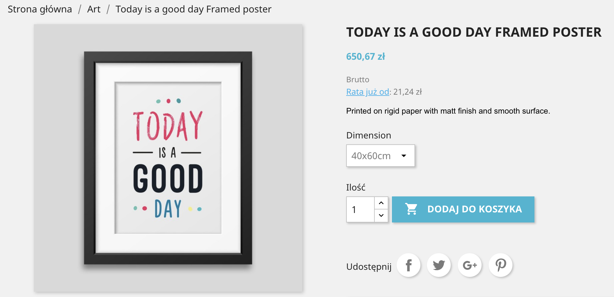
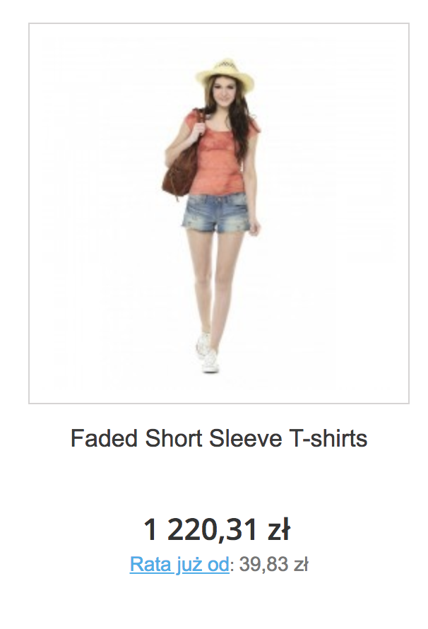

[**English version**][ext0]

# Moduł PayU dla PrestaShop 1.6 i 1.7
``Moduł jest wydawany na licencji GPL.``

**Jeżeli masz jakiekolwiek pytania lub chcesz zgłosić błąd zapraszamy do kontaktu z naszym [wsparciem technicznym][ext13].**

Uwaga: plugin w [wersji 2.x](https://github.com/PayU/plugin_prestashop/tree/2.x) wspiera PrestaShop w wersji 1.4 i 1.5, ale nie jest dalej rozwijany.

## Spis treści

* [Cechy i kompatybilność](#cechy-i-kompatybilność)
* [Wymagania](#wymagania)
* [Instalacja](#instalacja)
* [Aktualizacja](#aktualizacja)
* [Konfiguracja](#konfiguracja)
* [Więcej o cechach](#więcej-o-cechach)
    * [Wielowalutowość](#wielowalutowość)
    * [Wyświetlenie metod płatności](#wyświetlenie-metod-płatności)
    * [Płatność kartą](#płatność-kartą)
    * [Płatność kartą - widżet](#widżet-do-płatności-kartą)
    * [Ponowienie płatności](#ponowienie-płatności)
    * [Promowanie płatności ratalnych i odroczonych](#promowanie-płatności-ratalnych-i-odroczonych)

## Cechy i kompatybilność
Moduł płatności PayU dodaje do PrestaShop opcję płatności PayU i pozwala na następujące operacje:

Plugin w wersji 3.x wspiera PrestaShop w wersji 1.6 i 1.7

| Cecha | PrestaShop 1.6 | PrestaShop 1.7 |
|---------|:-----------:|:-----------:|
| Utworzenie płatności (wraz z rabatami) | :white_check_mark: | :white_check_mark: |
| Odebranie lub odrzucenie płatności (w przypadku wyłączonego autoodbioru) | :white_check_mark: | :white_check_mark: |
| Utworzenie zwrotu (pełnego lub częściowego) | :white_check_mark: | :white_check_mark: |
| Wyświetlenie metod płatności i wybranie metody na stronie podsumowania zamówienia | :white_check_mark: | :white_check_mark: |
| Płatność kartą jako osobna metoda płatności | :white_check_mark: | :white_check_mark: |
| Płatność kartą jako widżet na stronie podsumowania zamówienia | :white_check_mark: | :white_check_mark: |
| Ponowienie płatności przez klienta w przypadku anulowania | :white_check_mark: | :white_check_mark: |
| Wielowalutowość | :white_check_mark: | :white_check_mark: |
| Kolejność metod płatności | :white_check_mark: | :white_check_mark: |
| Promowanie [PayU Raty][ext10] i [PayU Płacę Później][ext9] | :white_check_mark: | :white_check_mark: |
| Płatność Twisto jako osobna metoda płatności | :white_check_mark: | :white_check_mark: |
| Prezentacja kalkulacji ratalnej przy produkcie i listingu | :white_check_mark: | :white_check_mark: |
| Prezentacja kalkulacji ratalnej na podsumowaniu | :white_check_mark: | :white_check_mark: |
| Prezentacja kalkulacji ratalnej w koszyku | :x: | :white_check_mark: |

Więcej informacji o cechach można znaleźć w rozdziale [Więcej o cechach](#więcej-o-cechach)

**Wszyskie opisy w tej instrukcji odnoszą się do PrestaShop 1.6, w wersji 1.7 należy używać opcji analogicznych**.

## Wymagania

**Ważne:** Moduł działa tylko z punktem płatności typu `REST API` (Checkout).
Jeżeli nie posiadasz jeszcze konta w systemie PayU [**zarejestruj się w systemie produkcyjnym**][ext4] lub [**zarejestruj się w systemie sandbox**][ext5]

Do prawidłowego funkcjonowania modułu wymagane są następujące rozszerzenia PHP: [cURL][ext1] i [hash][ext2].

## Instalacja

### Opcja 1
**przeznaczona dla użytkowników bez dostępu poprzez FTP do instalacji PrestaShop**

1. Pobierz moduł z [repozytorium GitHub][ext3] jako plik zip
1. Rozpakuj pobrany plik
1. **Utwórz archiwum zip z katalogu `payu`**
1. Przejdź do strony administracyjnej swojego sklepu PrestaShop [http://adres-sklepu/adminxxx].
1. Przejdź do `Moduły` » `Moduły i usługi`
1. Naciśnij przycisk `Dodaj nowy moduł` i wybierz plik z archiwum modułu (utworzonej w punkcie 3)
1. Naciśnij przycisk `Prześlij moduł`

### Opcja 2
**przeznaczona dla użytkowników z dostępem poprzez FTP do instalacji PrestaShop**

1. Pobierz moduł z [repozytorium GitHub][ext3] jako plik zip
1. Rozpakuj pobrany plik
1. Połącz się z serwerem ftp i skopiuj katalog `payu` z rozpakowanego pliku do katalogu `modules` swojego sklepu PrestaShop  

## Aktualizacja

1. Zaktualizuj plik modułu zgodnie z punktem [Instalacja](#instalacja)
1. Przejdź do `Moduły` » `Moduły i usługi` - zostanie przeprowadzona automatyczna aktualizacja modułu jeżeli jest wymagana
1. Przejdź do `Parametry zaawansowane` » `Wydajność` i naciśnij przycisk `Wyczyść pamięć podręczną`  

## Konfiguracja

1. Przejdź do strony administracyjnej swojego sklepu PrestaShop [http://adres-sklepu/adminxxx].
1. Przejdź do `Moduły` » `Moduły i usługi`
1. Wyszukaj `PayU` i naciśnij `Konfiguruj`

### Sposób integracji

| Parameter | Opis |
|---------|-----------|
| Wyświetlaj metody płatności na stronie podsumowania zamówienia w PrestaShop | **Tak** - metody płatności zostaną wyświetlone na stronie podsumowania zamówienia w PrestaShop **Nie** - po złożeniu zamówienia w PrestaShop nastąpi automatyczne przekierowanie do PayU |
| Płatność kartą jako osobna metoda płatności | Określa czy płatność kartą będzie dostępna jako osobna metoda [więcej informacji](#płatność-kartą) |
| Płatność kartą w widżecie | Określa czy płatność kartą będzie dostępna jako widżet [więcej informacji](#widżet-do-płatności-kartą) |
| Kolejność metod płatności | Określa kolejność wyświetlanych metod płatności [więcej informacji](#kolejność-metod-płatności) |
| Tryb testowy (Sandbox) | **Tak** - transakcje będą procesowane przez system Sandbox PayU **Nie** - transakcje będą procesowane przez system produkcyjny PayU |

### Parametry POS-ów

Dla każdej waluty dodanej w PrestaShop należy dodać parametry (osobno dla środowiska produkcyjnego i sandbox):

| Parameter | Opis |
|---------|-----------|
| Id punktu płatności| Identyfikator POS-a z systemu PayU |
| Drugi klucz MD5 | Drugi klucz MD5 z systemu PayU |
| OAuth - client_id | client_id dla protokołu OAuth z systemu PayU |
| OAuth - client_secret | client_secret for OAuth z systemu PayU |

### Statusy płatności
Mapowanie statusów płatności w PayU na statusy w skepie PrestaShop

| Nazwa | Status w PayU | Domyślny status w Presta |
|---------|-----------|-----------|
| Rozpoczęta | `NEW` i `PENDING` | Płatność PayU rozpoczęta |
| Oczekuje na odbiór | `WAITING_FOR_CONFIRMATION` i `REJECTED` | Płatność PayU oczekuje na odbiór |
| Zakończona | `COMPLETED` | Płatność zaakceptowana |
| Anulowana | `CANCELED` | Płatność PayU anulowana |

W przypadku włączenia opcji `Kontrola zmiany statusów` dla statusów "Zakończona" i "Anulowana" możliwe jest przejście tylko ze statusów "Rozpoczęta" i "Oczekuje na odbiór"

## Więcej o cechach

### Kolejność metod płatności
Ma zastosowanie tylko przy ustawionej opcji **Wyświetlaj metody płatności na stronie podsumowania zamówienia w PrestaShop** na `Tak`

W celu ustalenia kolejności wyświetlanych ikon metod płatności należy podać symbole metod płatności oddzielając je przecinkiem. [Lista metod płatności][ext6].

### Wielowalutowość
POS w systemie PayU ma jedną walutę. Jeżeli chcemy akceptować płatność w sklepie PrestaShop w wielu walutach niezbędne jest dodanie konfiguracji POSa dla każdej waluty z osobna.   
Błąd ERROR_INCONSISTENT_CURRENCIES oznacza nieobsługiwaną walutę przez POS. Kontakt z obsługą PayU jest wymagany przy zatwierdzeniu możliwości przyjmowania płatności w innej walucie dla trybu sandbox jak i osobnej umowy dla trybu produkcyjnego. 

### Wyświetlenie metod płatności
Przy ustawionej opcji **Wyświetlaj metody płatności na stronie podsumowania zamówienia w PrestaShop** na `Tak` po wybraniu płatności przez PayU wyświetli się strona z ikonami banków bezpośrednio w sklepie PrestaShop.
Ikony banków, które są wyświetlane pobierane są z konfiguracji POS-a w PayU w zależności od wybranej waluty.  

![payment_methods][img3]

### Płatność kartą
Przy ustawionej opcji **Płatność kartą jako osobna metoda płatności** na liście metod płatności w procesie zakupowym Prestashop wyświetli się jako osobna metoda o nazwie `Zapłać kartą`.

Jeżeli **Wyświetlaj metody płatności na stronie podsumowania zamówienia w PrestaShop** jest ustawione na `Tak` to metoda `Zapłać kartą` będzie wyświetlana jeżeli na POS-ie jest dostępna płatnośc kartą. W przeciwnym wypadku metoda `Zapłać kartą` kartą będzie wyświetlana zawsze ale jeżeli na POS-ie brak jest metody płatnoś kartą to wtedy płatność się nie powiedzie. 

![payment_methods][img6]

### Widżet do płatności kartą
**WAŻNE** - do prawidłowego działania niezbędne jest włączenie tokenizacji w konfiguracji POS-a. W tym celu należy się skontaktować z naszym [wsparciem technicznym][ext13].

Przy ustawionej opcji **Płatność kartą jako osobna metoda płatności** oraz **Płatność kartą jako widżet na stronie podsumowania zamówienia** na `Tak` po wybraniu płatności `Zapłać kartą` zamiast przekierowania do PayU pojawi się widżet do wprowadzenia danych karty. 

![widget][img5]

### Ponowienie płatności
W przypadku nieudanej płatności w PayU możliwe jest ponowienie takiej płatności samodzielnie przez kupującego.

Żeby kupujący mógł ponowić płatność muszą być spełnione następujące warunki:
* status ostatniej płatności z PayU musi mieć status CANCELED
* status zamówienia w PrestaShop musi być zgodny ze statusem wybranym w konfiguracji wtyczki `Statusy płatności` » `Anulowana`    

Kupującemu w `Szczegółach zamówienia` wyświetlany jest przycisk `Ponów płatność z PayU`.

![retry_payment][img4]

W panelu administracyjnym w szczegółach zamówienia wyświetlane są wszystkie utworzone płatności w PayU wraz ze statusami.

### Promowanie płatności ratalnych i odroczonych
Od wersji 3.0.10 plugin udostępnia opcję promowania [płatności ratalnych i odroczonych][ext7].
Funkcjonalność jest domyślnie włączona. Można ją dezaktywować poprzez przełącznik "Promuj płatności ratalne" w panelu
 admińskim. Wsparcie dla konkretnych funkcjonalności przedstawione zostało w tabeli [Cechy i
 Kompatybilność](#cechy-i-kompatybilność).
 > Prezentacja kalkulacji zależna jest od dostępności bramek "ai" oraz "dpt" na danym punkcie płatności i sprawdzana
 jest automatycznie przez plugin. Jeśli na punkcie płatności nie zostały aktywowane Raty PayU kalkulacja nie zostanie
 zaprezentowana pomimo włączonej opcji w pluginie.

#### Prezentacja kalkulacji w zależności od wersji PrestaShop
|Wersja PrestaShop|Kategoria|Prezentacja|
|---------|-----------|-----------|
|1.7|Listing produktów|  |
|1.7|Karta produktu||
|1.7|Koszyk| |
|1.7|Promowanie płatności ratalnych||
|1.7|Wydzielenie Twisto jako metody płatności||
|1.6|Listing produktów||
|1.6|Karta produktu||

#### Prezentacja kalkulacji po kliknięciu w link "Rata już od:"
Plugin do kalkulacji kredytu używa najnowszej wersji elementu "miniratka" wchodzącego w skład pakietu [PayU Raty -
dobre praktyki][ext12], który znajduje się w [oficjalnej dokumentacji technicznej][ext8].

Widget z kalkulacją ratalną wygląda następująco:

<!--LINKS-->

<!--external links:-->
[ext0]: README.EN.md
[ext1]: http://php.net/manual/en/book.curl.php
[ext2]: http://php.net/manual/en/book.hash.php
[ext3]: https://github.com/PayU/plugin_prestashop
[ext4]: https://www.payu.pl/oferta-handlowa
[ext5]: https://secure.snd.payu.com/boarding/?pk_campaign=Plugin-Github&pk_kwd=Prestashop#/form
[ext6]: http://developers.payu.com/pl/overview.html#paymethods
[ext7]: https://developers.payu.com/pl/installments.html
[ext8]: https://developers.payu.com/pl/installments.html#installments_best_practices_mini
[ext9]: https://placepozniej.payu.pl/
[ext10]: https://www.payu.pl/metody-platnosci-dla-biznesu/payu-raty
[ext11]: https://developers.payu.com/pl/installments.html#dp_best_practices_mini
[ext12]: https://developers.payu.com/pl/installments.html#best_practices_title
[ext13]: https://www.payu.pl/pomoc

<!--images:-->
[img3]: readme_images/bramki_platnosci.png
[img4]: readme_images/ponow_platnosc.png
[img5]: readme_images/widget.png
[img6]: readme_images/separate_card.png
